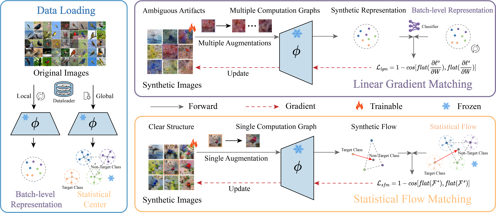
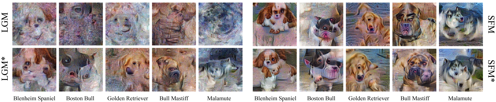
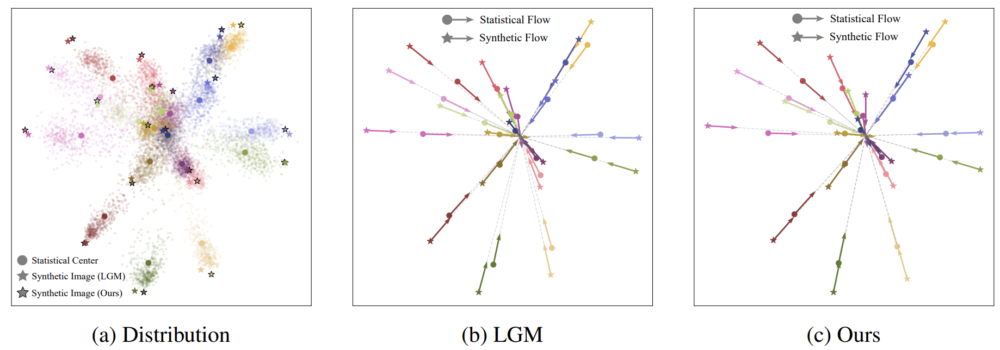

# 📝 Efficient Dataset Distillation for Pre-Trained Self-Supervised Models via Statistical Flow Matching [**[arxiv](https://arxiv.org/abs/2602.05391)**]  

## 📚 Introduction

Dataset distillation seeks to synthesize a highly compact surrogate dataset that achieves performance comparable to the original dataset on downstream tasks. For the scenario where pre-trained self-supervised models serve as priors, traditional **Linear Gradient Matching** optimizes synthetic images by encouraging them to mimic the gradient updates induced by real images on the linear probe or classifier. However, this batch-level formulation requires loading thousands of real images and applying multiple differentiable augmentations to synthetic images at each distillation step, leading to substantial computational and memory overheads. In this paper, we revisit the linear gradient and theoretically derive that it is essentially a **local** relative distribution directed from target class centers toward non-target class centers, which we term ``flow”. This property causes instability and suboptimality, often necessitating expensive multiple augmentations to compensate. To address this, we introduce **Statistical Flow Matching**, a stable and efficient supervised learning framework that optimizes synthetic images by aligning **global** statistical flows in the original data. Our approach loads raw statistics only once and performs a single augmentation pass on the synthetic data, achieving performance comparable to or better than the state-of-the-art method with 10× less GPU memory usage and 4× faster distillation time. Moreover, increasing the number of augmentations for our method yields further performance gains while incurring lower additional cost.




## 🔥 Synthetic Images and Flow





## 🚀 Quick Start

### Create environment and install dependencies
```sh
conda create -n sfm python=13
conda activate sfm

pip install -r requirements.txt
```
### Get Statistical Center

```sh
sh get_statistic.sh
```

### Get golden Classifier

If Classifier Inheritance (CI) is used, pre-train a classifier on the full dataset and report its performance.

```sh
sh get_classifier.sh
```

### Distillation

```sh
sh distill.sh
```

### Evaluation

```sh
sh eval_syn.sh
```

eval_mode: Literal["CI", "KD", "JT", "ST", "normal"] = "normal"


## 🎉 Acknowledgments
Our code is developed based on the following codebase: [Dataset Distillation for Pre-Trained Self-Supervised Vision Models]([GeorgeCazenavette/linear-gradient-matching](https://github.com/GeorgeCazenavette/linear-gradient-matching))<br>

We sincerely thank [George Cazenavette](https://georgecazenavette.github.io/) for his continued contributions to the dataset distillation community.<br>

## 🍿 Citation
If you find this work useful, please consider citing:

```bibtex
@article{xia2026efficient,
  title={Efficient Dataset Distillation for Pre-Trained Self-Supervised Models via Statistical Flow Matching},
  author={Xia, Qianxin and Du, Jiawei and Zhang, Xin and Zhang, Yuhan and Wang, Jielei and Lu, Guoming},
  journal={NeurIPS},
  year={2026}
}
